# 📊 ERD Diagrams - Visual Documentation

Tài liệu này chứa các sơ đồ ERD và flow diagrams sử dụng Mermaid syntax. Các diagram này có thể render trực tiếp trong GitHub, VS Code (với Mermaid extension), hoặc các Markdown viewers hỗ trợ Mermaid.

---

## 📐 Entity Relationship Diagram (ERD)

### Full Database Schema

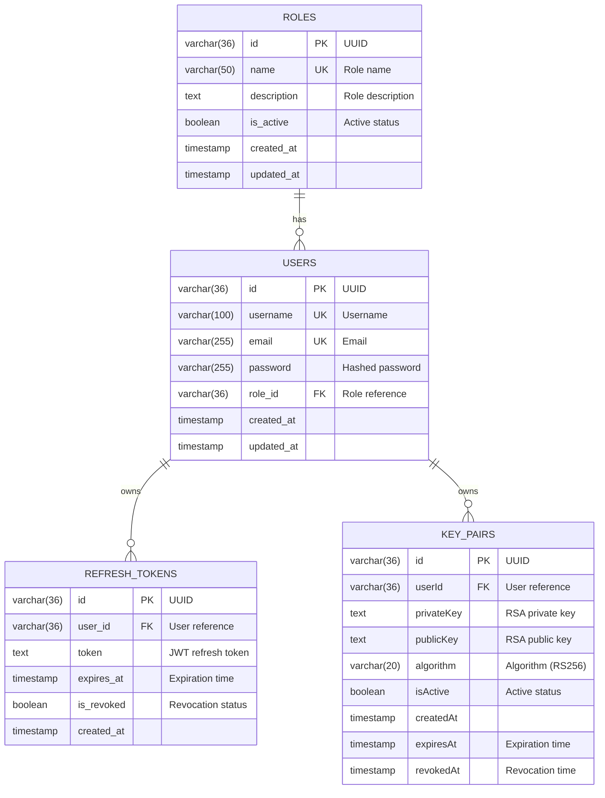

---

## 🔄 Authentication Flow Diagrams

### 1. Register Flow

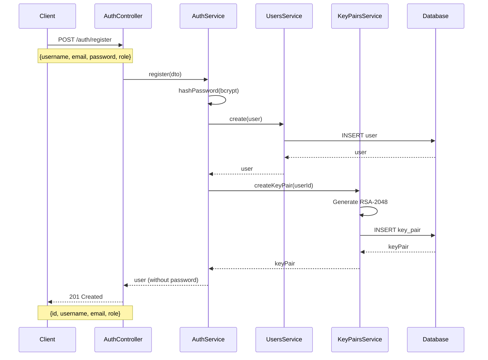

---

### 2. Login Flow

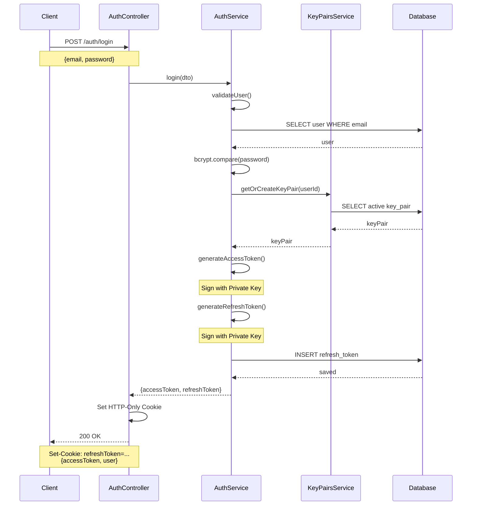

---

### 3. Protected Route Access Flow

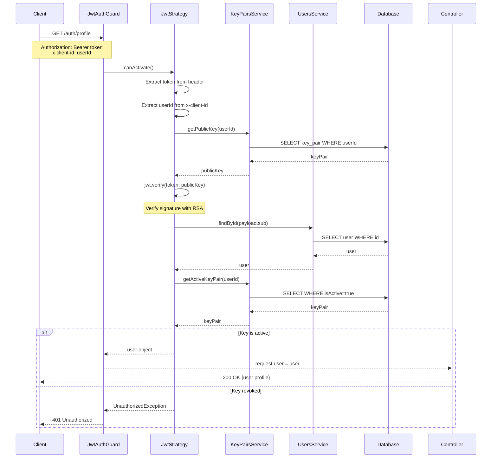

---

### 4. Refresh Token Flow

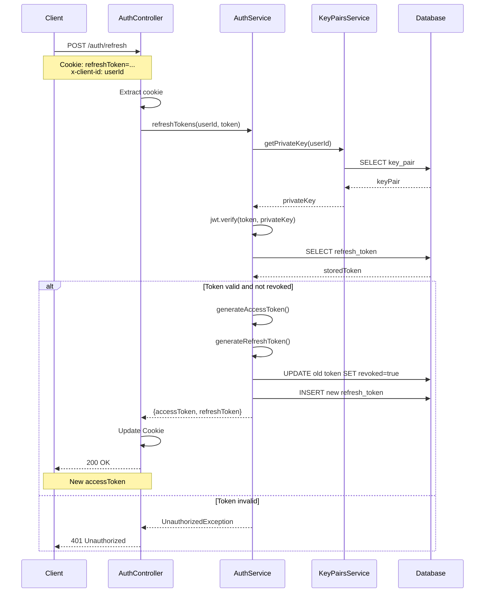

---

### 5. Logout Flow

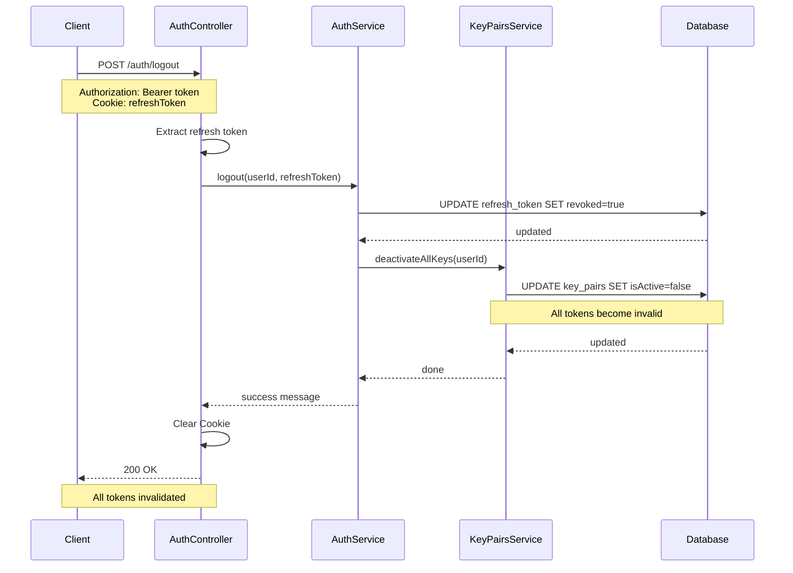

---

### 6. Key Rotation Flow

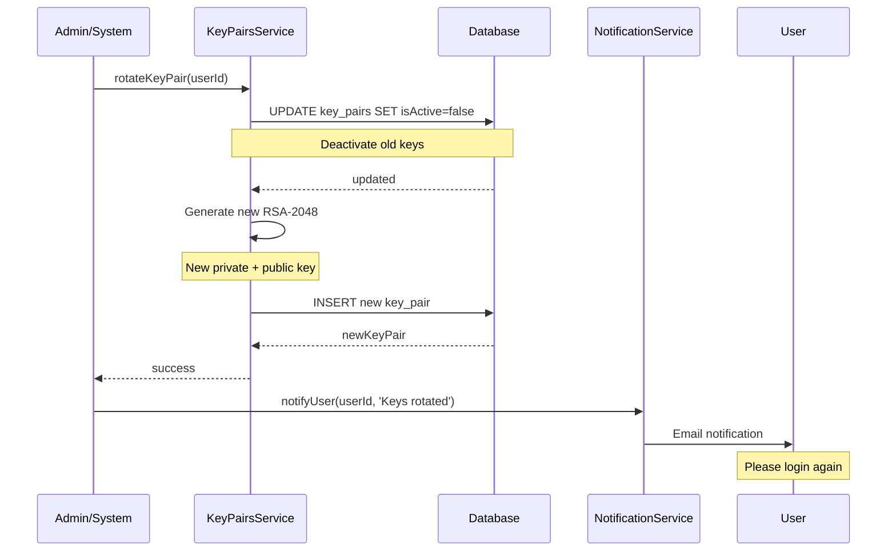

---

## 🔐 JWT Token Structure

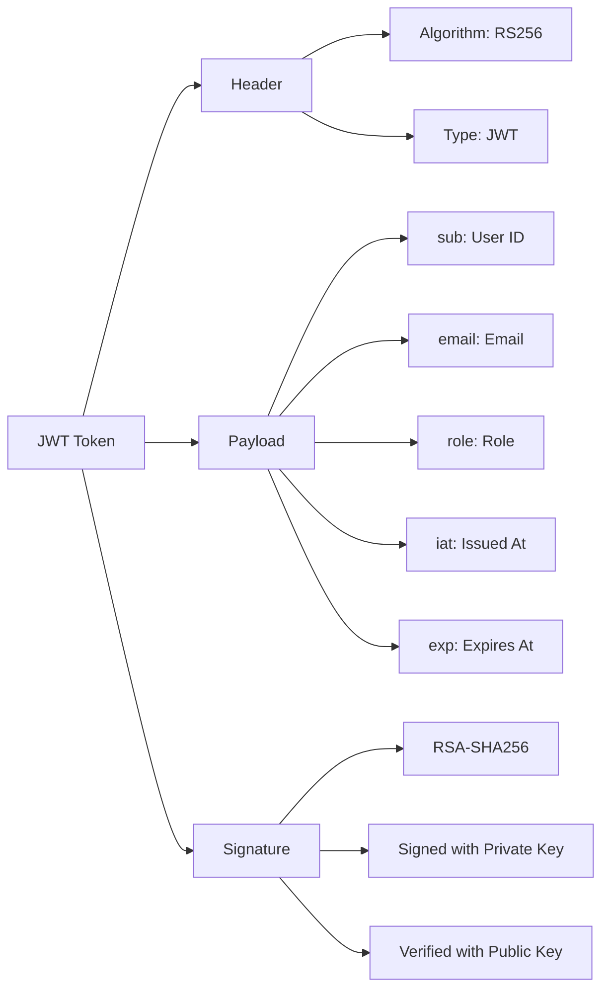

---

## 🔑 Key Management Lifecycle

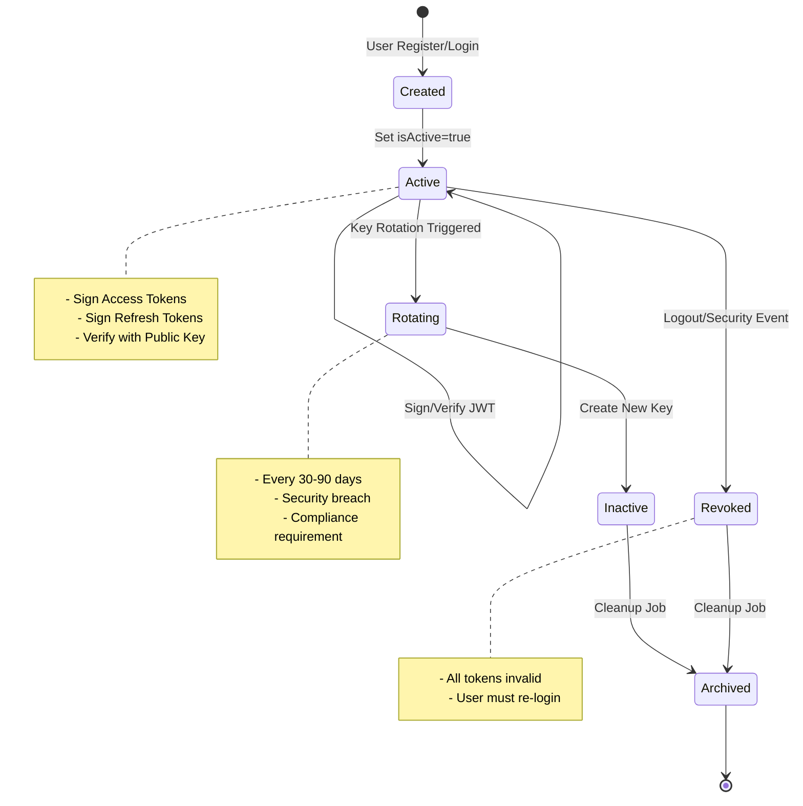

---

## 🛡️ Security Layers

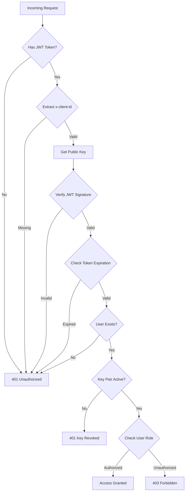

---

## 🔄 Token Lifecycle

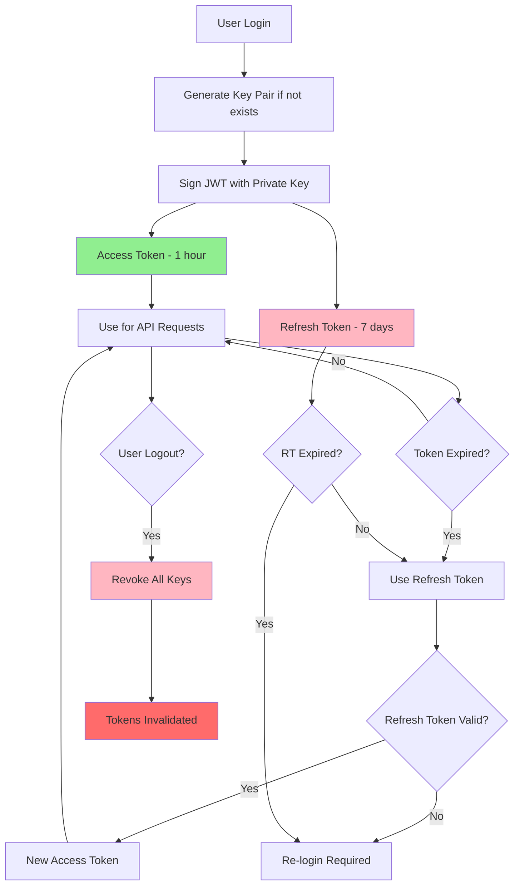

---

## 🏗️ System Architecture

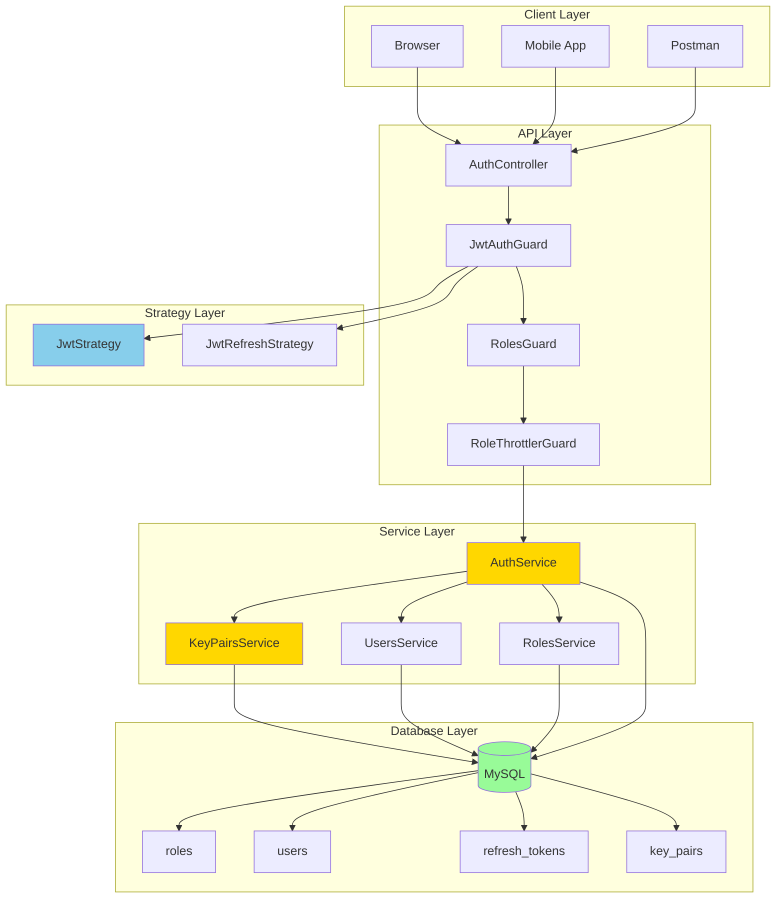

---

## 📊 Performance Flow

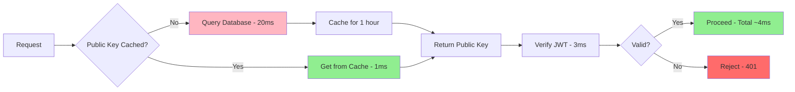

---

## 🔐 Encryption Comparison

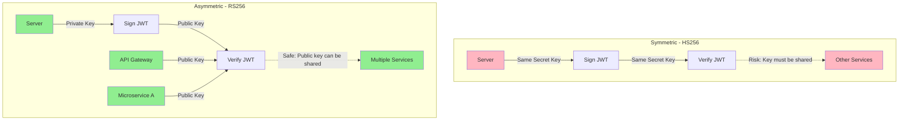

---

## 📈 Monitoring Dashboard Metrics

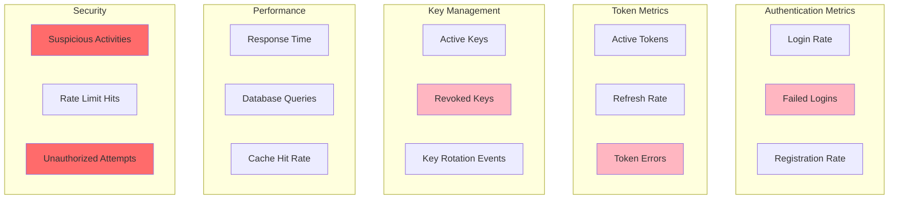

---

## 🎯 Decision Flow: Which Token to Use?

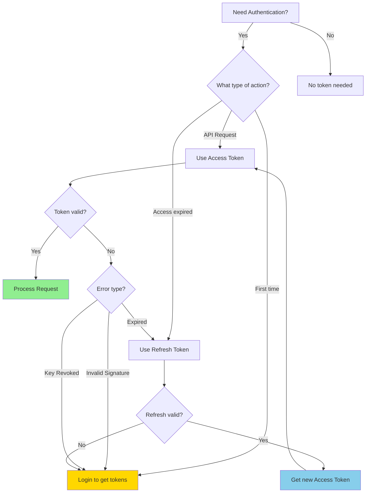
